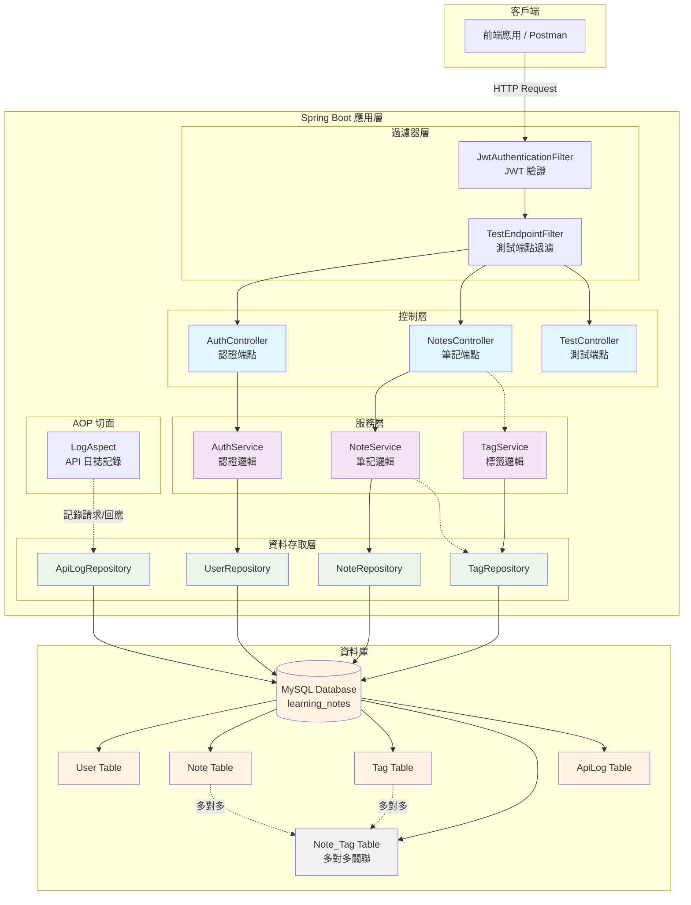
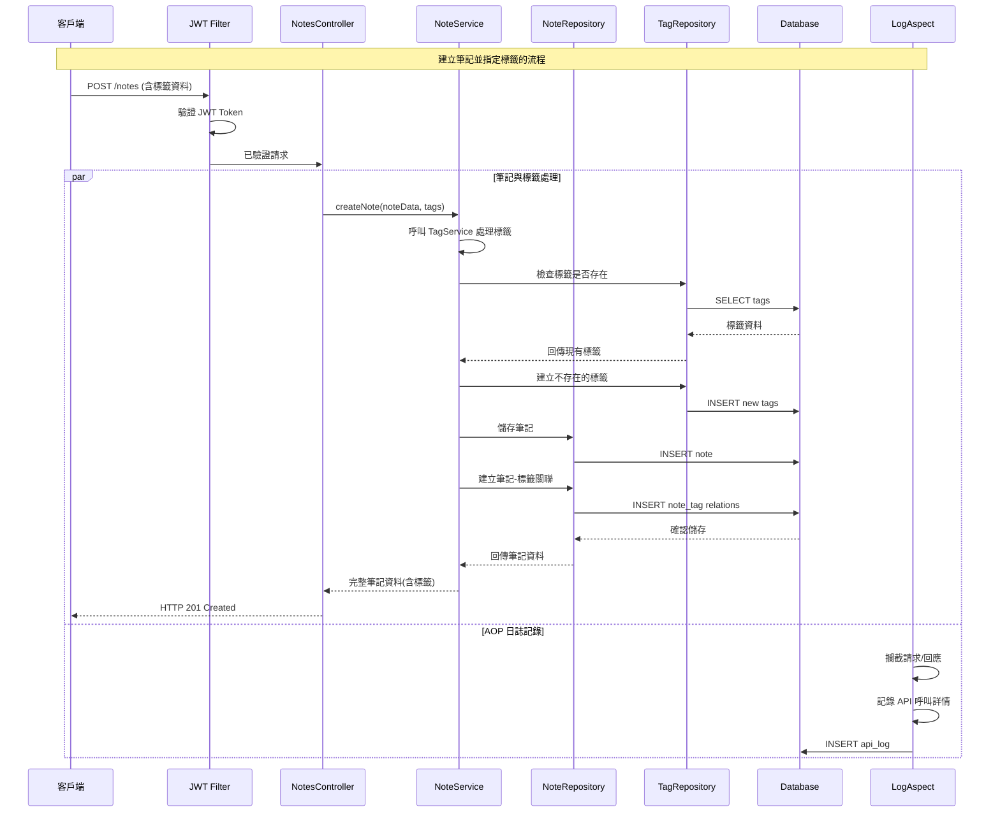

# 📘 線上學習筆記平台 API

本專案是一個使用 Spring Boot 開發的線上學習筆記平台後端 API，  
提供使用者一個可以隨時做筆記，並且方便查詢過往筆記的服務。

---

## 🔧 功能列表

- 使用者註冊與登入（JWT 驗證機制）
- 新增筆記（POST /notes）
- 查詢所有筆記或單筆筆記（GET /notes、GET /notes/{id}）
- 更新筆記（PUT /notes/{id}）
- 刪除筆記（DELETE /notes/{id}）
- 請求日誌自動寫入資料庫（AOP 實作）

---

## 🛠 使用技術

- Java 17
- Spring Boot 3.x
- Spring Security
- Spring Data JPA
- Spring AOP
- JWT (JSON Web Token)
- Lombok
- MySQL 8
- IntelliJ IDEA（開發工具）
- Git + GitHub（版本控制）

---

## 🏗️ 專案架構

本專案遵循標準的 Spring Boot 專案結構，採分層設計模式：

### 系統架構圖



### 資料流向



### 套件結構

```
src/main/java/com/jeannychiu/learningnotesapi/
├── aspect         // AOP 切面，用於日誌紀錄
├── config         // 應用程式組態
├── controller     // API 端點控制器
├── dto            // 資料傳輸物件
├── exception      // 自定義例外處理
├── model          // 資料庫實體
├── repository     // 資料存取層
├── security       // Spring Security 安全性組態
├── service        // 商業邏輯層
└── LearningNotesApiApplication.java // Spring Boot 啟動類別
```

---

## 🚀 使用說明

### 1. 環境需求
- Java 17 或以上版本
- MySQL 8 或以上版本
- Maven 3.6 或以上版本

### 2. 環境變數設定

在啟動應用程式前，請設定以下環境變數：

```bash
# JWT 金鑰設定（必要）
export JWT_SECRET=your-secret-key-here

# 資料庫連線設定（可選，有預設值）
export DB_HOST=localhost
export DB_PORT=3306
export DB_NAME=learning_notes
export DB_USERNAME=root
export DB_PASSWORD=your-password

# 應用程式埠號（可選，預設 8080）
export SERVER_PORT=8080
```

**重要提醒**：
- `JWT_SECRET` 為必要環境變數，建議使用至少 256 位元的隨機字串
- 生成安全的 JWT Secret 範例：
  ```bash
  # 使用 openssl 生成隨機字串
  openssl rand -base64 32
  
  # 或使用線上生成器：https://generate-random.org/api-key-generator
  ```

### 3. 資料庫準備
```sql
-- 建立資料庫
CREATE DATABASE learning_notes CHARACTER SET utf8mb4 COLLATE utf8mb4_unicode_ci;

-- 建立使用者（可選）
CREATE USER 'notes_user'@'localhost' IDENTIFIED BY 'your-password';
GRANT ALL PRIVILEGES ON learning_notes.* TO 'notes_user'@'localhost';
FLUSH PRIVILEGES;
```

### 4. 應用程式啟動

#### 方法一：使用環境變數啟動
```bash
# 設定環境變數後啟動
export JWT_SECRET=your-secret-key-here
./mvnw spring-boot:run
```

#### 方法二：直接在指令中指定環境變數
```bash
JWT_SECRET=your-secret-key-here ./mvnw spring-boot:run
```

#### 方法三：使用 IDE 啟動
在 IDE 中設定環境變數：
```
JWT_SECRET=your-secret-key-here
```

應用程式啟動後，可於以下位置存取：
- **API 服務**：`http://localhost:8080/`
- **Swagger UI**：`http://localhost:8080/swagger-ui.html`
- **API 文件**：`http://localhost:8080/v3/api-docs`

### 5. 資料表建立
- 若使用 JPA 的自動建表（如 `spring.jpa.hibernate.ddl-auto=update`），會自動建立所需 table
- 若需手動建表，請參考實體類別設計自建

### 6. API 測試工具
本專案提供多種 API 測試方式：
- **Swagger UI**：`http://localhost:8080/swagger-ui.html`（推薦，含完整文件）
- **Postman Collection**：匯入專案根目錄的 `Learning-Notes-API.postman_collection.json`
- **HTTP 檔案**：使用專案中的 `demo.http` 檔案（適用於 IntelliJ IDEA）
- **curl 指令**：直接使用 command line 測試

---

## 📚 API 文件與測試

### Swagger UI（推薦）
啟動應用程式後，訪問以下網址查看完整的 API 文件：

🔗 **Swagger UI**: [`http://localhost:8080/swagger-ui.html`](http://localhost:8080/swagger-ui.html)

Swagger UI 提供：
- 完整的 API 端點說明
- 請求/回應格式範例
- 互動式 API 測試介面
- JWT 認證功能（點擊右上角的 🔒 按鈕輸入 Bearer token）

### Postman Collection
專案提供完整的 Postman 測試集合：

📁 **Collection 檔案**: `Learning-Notes-API.postman_collection.json`  
📁 **環境變數檔案**: `Learning-Notes-API.postman_environment.json`

**使用步驟**：
1. 開啟 Postman
2. 點擊 **Import** → **Upload Files**
3. 選擇專案根目錄的兩個 JSON 檔案
4. 匯入後在右上角選擇 "Learning Notes API" 環境
5. 先執行「註冊新用戶」或「用戶登入」取得 JWT token
6. Token 會自動設定到環境變數中，其他 API 可直接測試

### HTTP 檔案測試
適用於 IntelliJ IDEA 或 VS Code（需安裝 REST Client 擴充）：

📁 **HTTP 檔案**: `demo.http`

直接在 IDE 中開啟檔案，點擊請求旁的 ▶️ 按鈕即可測試。

---

## 📬 API 測試範例

### ➤ 使用者註冊

- **Method**：POST
- **URL**：`http://localhost:8080/register`
- **Header**：`Content-Type: application/json`
- **Body**：

    ```json
    {
      "email": "user@example.com",
      "password": "password123"
    }
    ```

---

### ➤ 使用者登入

- **Method**：POST
- **URL**：`http://localhost:8080/login`
- **Header**：`Content-Type: application/json`
- **Body**：

    ```json
    {
      "email": "user@example.com",
      "password": "password123"
    }
    ```
- **說明**：成功登入會回傳 JWT Token，請於下方 API 帶入。

---

### ➤ 使用 JWT Token 認證

除註冊與登入外，其餘 API 需在 Header 加入：
`Authorization: Bearer {登入取得的 token}`

---

### ➤ 新增筆記

- **Method**：POST
- **URL**：`http://localhost:8080/notes`
- **Header**：
  - `Content-Type: application/json`
  - `Authorization: Bearer {token}`
- **Body**：

  ```json
  {
    "title": "學習 Spring Boot",
    "content": "這是我的第一筆筆記"
  }
  ```

---

### ➤ 查詢所有筆記

- **Method**：GET
- **URL**：`http://localhost:8080/notes`
- **Header**：`Authorization: Bearer {token}`
---

### ➤ 查詢特定筆記

- **Method**：GET
- **URL**：`http://localhost:8080/notes/{id}`
- **範例**：`http://localhost:8080/notes/1`
- **Header**：`Authorization: Bearer {token}`

---

### ➤ 更新筆記

- **Method**：PUT
- **URL**：`http://localhost:8080/notes/1`
- **Header**：
    - `Content-Type: application/json`
    - `Authorization: Bearer {token}`
- **Body**：
    ```json
    {
      "title": "更新後的標題",
      "content": "更新後的內容"
    }
    ```

---

### ➤ 刪除筆記

- **Method**：DELETE
- **URL**：`http://localhost:8080/notes/1`
- **Header**：`Authorization: Bearer {token}`

---

### ➤ 常見錯誤回應
- `401 Unauthorized`：未登入或 Token 無效/過期
- `403 Forbidden`：已登入但無操作權限
- `404 Not Found`：資源不存在
- `400 Bad Request`：參數錯誤

---

### 🗒️ 日誌紀錄與查詢
- 所有 API 請求與回應（包含狀態碼、請求內容等）會自動寫入資料庫（如 api_log 表）。
- 可用資料庫查詢驗證日誌寫入，例如：
    ```sql
      SELECT * FROM api_log ORDER BY id DESC LIMIT 10;
    ```
- 若部分 response 無法序列化，log 內容會顯示 Failed to parse response body 屬正常現象。
---

## ✅ 專案狀態

目前已完成核心的筆記 CRUD API，並整合 Spring Security 實現了使用者註冊、登入及 JWT 驗證機制。專案採用分層架構，並包含統一的例外處理與日誌紀錄功能。

後續可擴充功能包含：
- 更細緻的權限控制（例如：使用者只能存取自己的筆記）
- API 文件（Swagger / OpenAPI）
- 單元測試與整合測試
- 前端整合（如 Vue/React）
- 管理員功能

---

## 👩‍💻 作者

Jeanny Chiu  
GitHub: [@jeannyChiu](https://github.com/jeannyChiu)
